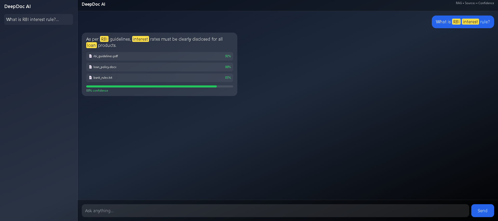
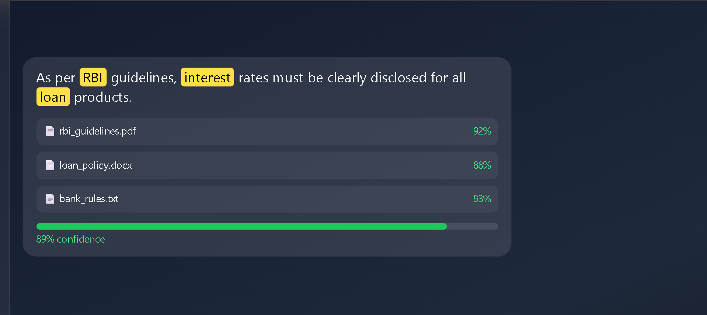
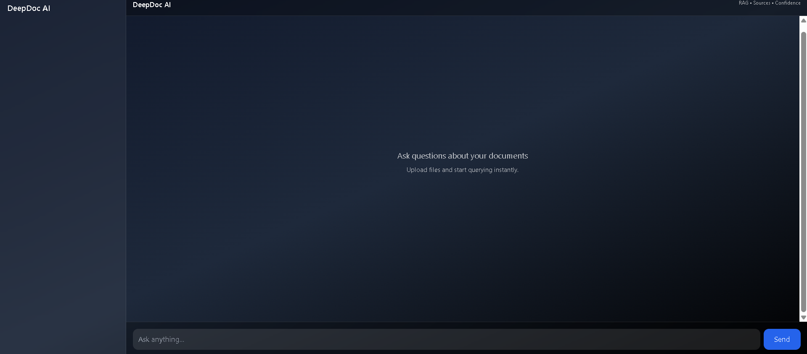

# DeepDoc AI 🚀

DeepDoc AI is a Retrieval-Augmented Generation (RAG) based knowledge chatbot that allows users to upload documents and query them intelligently.

## 🔥 Features

- Upload documents (PDF, TXT, DOCX)
- Chat-based interface
- Highlight matched keywords
- Top 3 source retrieval
- Confidence score visualization
- Dark modern UI (ChatGPT-style)

## 🧠 How it works

1. Documents are processed into embeddings
2. Stored in FAISS vector database
3. User query retrieves top relevant chunks
4. System returns answer + sources + confidence

## 🛠 Tech Stack

- Frontend: React + Tailwind CSS
- Backend: Node.js (planned)
- AI Engine: FastAPI + FAISS + LangChain
- Embeddings: HuggingFace

## 📸 Screenshots

## 🚀 Future Improvements

- Local LLM integration (Ollama)
- Agent-based reasoning
- Cloud deployment